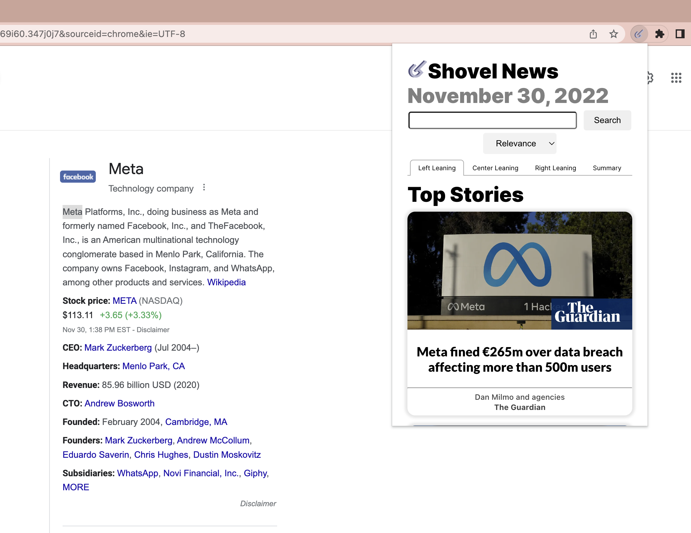

# Media Bias and News Analysis Tool

Our media bias and news analysis tool (Shovel) is a chrome extension that provides users with the ability to highlight text and find relevant articles and more background context.

## Prerequisites

Node.js, npm, Python3, pip3, NewsAPI account at `https://newsapi.org/`

## Set Up

To set up our application, there are a few steps.

### Chrome Extension

cd into `client` folder

run `yarn run build`

in a chrome browser, go to: `chrome://extensions/`

in this website, click on `load unpacked` and upload the build folder from the `client` folder.

### Server

cd into `server` folder

in the `.env` file, replace `MY_API_KEY` with your personal API key from NewsAPI

run `npm i nodemon && npm start`. You can check if this server works at the port you define: (ex: localhost:8081)

### Backend - Python

cd into `backend` folder

run `pip3 install -r requirements.txt` this will allow you to download all of the relevant packages for NLP processing

run `python3 app.py` to start the server. You can check if the server works at the port you define. (ex: localhost:8000)

## Usage

Go to any article online or page online. Highlight a portion of text. 

Now, we want to click on the chrome extension and recieve the relevant articles. 

## COMMON ERRORS TROUBLESHOOTING:

If you have other active extensions (particularly adblockers), you might need to disable them.

If you have just updated the extension in developer tools, you need to reload/refresh any page you are going to use the extension on. As a general practice, after loading the `build` folder into `chrome://extensions/`, you should refresh the page you return to. 
